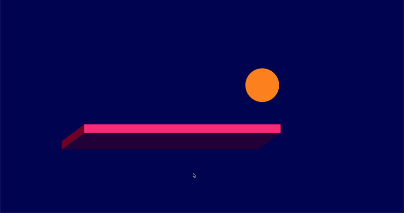

# bouncing-ball
Tried to draw a ball which bounces from the window and the bar in middle.
Projects for Practicing Creative, Interactive Coding (with YouTube tutorials)

[GO TO THE PAGE>>>>] (https://yooheana.github.io/Drawing-on-canvas-1/)

Details
-------------
* if the ball reach the window (of browser), 
* if the ball reach the bar,
      the ball bounces.
      
      
## Built With

* JavaScript Canvas
